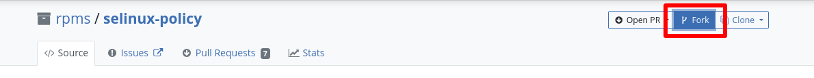
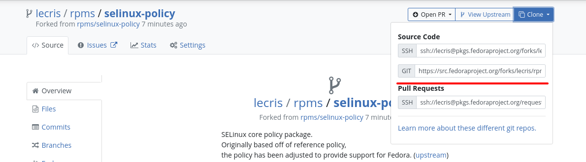

# I managed to build stuff, can I contribute to Fedora now?

Great job, and yes you are very welcome to contribute to Fedora as an upcoming
packager. For the most part, you can simply submit a PR at
`src.fedoraproject.org/rpms/*` with your contributions. There are just a few
caveats to be aware of.

## Creating the fork and pushing as a non-packager

```{warning}
This documentation is a work in progress, expect some innacuracies in the
instructions.
```

```{note}
These issues will go away once the Fedora git forge is migrated away from
Pagure backend and you should be able to use the regular git workflows of
Codeberg (same Forgejo backend that will be used) or GitHub (Forgejo has high
feature partity with GitHub).
```

A common pitfall encountered as a non-packager contributor is in the forking
and creating a fork, because as a non-packager you do not have access to the
ssh git interface and would have to use the https interface instead. This can
be done from the cli using the `--anonymous` flag, e.g.
```console
$ fedpkg clone --anonymous <pkg>
$ cd <pkg>
$ fedpkg fork --anonymous
```

Alternatively you can use the web interface
```{subfigure}
:gap: 8px


```

```{todo}
What authentications is expected?
```

Once you have the git repo with your fork remote, the git workflow is the
usual one you would use in any git project: create a branch, commit changes,
push to your fork, create the PR. When you push to your fork, you should
already have a link to create the PR in the git log, or you can do it manually
from the UI
```{image} images/downstream/fork_2.png
```
or you can construct the url manually as
`src.fedoraproject.org/fork/<user>/rpms/<pkg>/diff/<target>..<source>`.

## Updating sources

Fedora uses a lookaside cache to store the sources used in the spec file, and
as a non-packager, you do not have access to upload the sources yourself [^1].
You can edit the spec file freely without updating the sources to rebuild the
package against newer dependencies, adjust the build instructions or metadata,
edit the bundled files and patches.

If your goal is to update a package, then contact a Fedora packager to do it on
your behalf. You can easily find one willing to help in the [#devel] channel.

[^1]: This is primarily because the sources need to be verified by a packager
  and guarantee that there are not any non-free licensed files, therefore this
  restriction will likely always be there in one form or another.

[#devel]: https://matrix.to/#/#devel:fedoraproject.org
