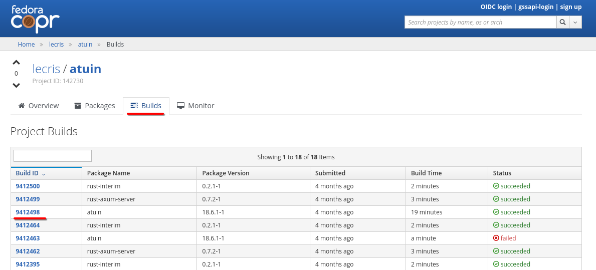
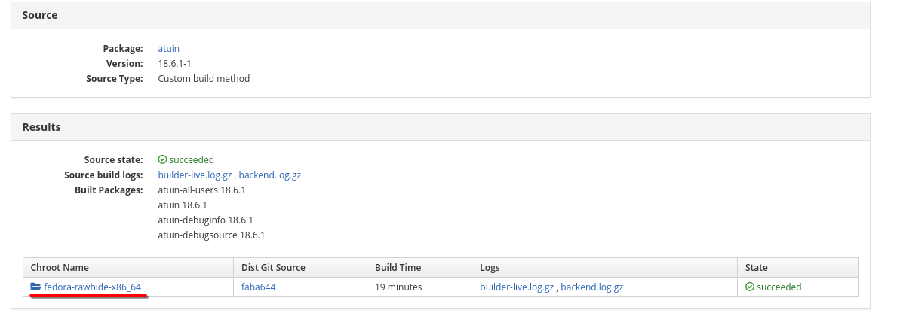
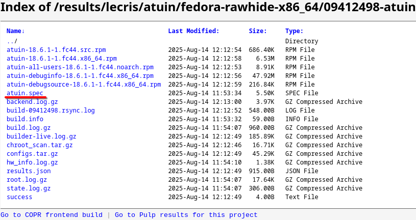

# Where do I begin?

Fedora/RPMs build process is all contained in a spec-file (file with the suffix
`.spec`).

## Where do I find these spec-files?

Depending on the projects you are interested in, you can find spec-files under:

::::{tab-set}

:::{tab-item} Fedora source

Fedora sources are found in [src.fedoraproject.org], under `rpms/*`, for
example [rpms/bash].

```{image} images/how_to_start/downstream_0.png
```

````{hint} Trouble finding the link?
Sometimes the _source_ spec/rpm (what is in the src.fedoraproject.org) is
differently named to the _binary_ rpms (what you install with `dnf install`).

You can find the original source from `dnf info` or [packages.fedoraproject.org].

```{code-block} console
:emphasize-lines: 8
$ dnf info atuin-all-users
Name            : atuin-all-users
Epoch           : 0
Version         : 18.6.1
Release         : 5.fc43
Architecture    : noarch
Installed size  : 777.0   B
Source          : atuin-18.6.1-5.fc43.src.rpm
```
````

[src.fedoraproject.org]: https://src.fedoraproject.org
[rpms/bash]: https://src.fedoraproject.org/rpms/bash
[packages.fedoraproject.org]: https://packages.fedoraproject.org
:::

:::{tab-item} Copr project

A single copr project can build multiple packages, which in turn can have
multiple builds (updates) for multiple chroots (distro bases), which in turn
ultimately provide the rpms.

What you need to navigate to here is a build which you want to investigate.

```{subfigure}
:gap: 8px



```
:::

:::{tab-item} Upstream

Upstream projects can also have their own spec file. One thing to be conscious
about though is whether the project's sources are alongside the spec file or
not. The latter case is called a dist-git, the same as with "Fedora source".

```{figure} images/how_to_start/upstream_0.png
Dist-git-like repo
```
```{figure} images/how_to_start/upstream_1.png
Upstream source repo
```

```{note}
Building rpms with upstream sources is a more involved process requiring quite
some automation. This will be covered in the [][upstream] section
```
[upstream]: upstream.md#upstream-packaging
:::

::::
